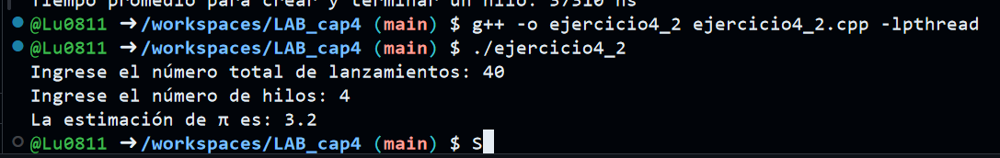
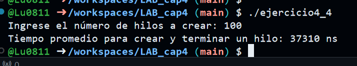
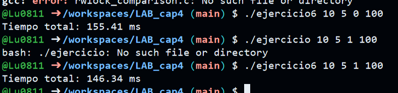

# Ejercicio 4.2: Estimación de π utilizando el Método de Monte Carlo con Hilos en C++

Este es un ejercicio en el que implementé el método de Monte Carlo para estimar el valor de π. Utilicé programación multihilo para distribuir el cálculo entre varios hilos y mejorar la eficiencia. En este archivo, explicaré el propósito del código, cómo se implementó y algunos problemas que encontré durante el desarrollo.

## Propósito

El objetivo de este ejercicio es estimar el valor de π mediante el método de Monte Carlo, que consiste en generar puntos aleatorios dentro de un cuadrado y verificar cuántos de esos puntos caen dentro de un círculo inscrito. La estimación de π se obtiene a partir de la relación entre los puntos dentro del círculo y el total de puntos generados.

## Descripción del Código

El código está estructurado de manera que utiliza múltiples hilos para paralelizar el proceso de generación de puntos aleatorios. Cada hilo calcula una parte de los puntos y luego los resultados parciales se combinan para estimar el valor de π.

### Explicación

1. **Variables globales y estructuras**

   ```cpp
   long long global_tiros_circulo = 0;
   pthread_mutex_t mutex = PTHREAD_MUTEX_INITIALIZER;

   struct ThreadData {
       long long tirosPerThread;
       unsigned int seed;
       long long local_tiros_circulo;
   };
   ```

   Aquí defino algunas variables globales y una estructura llamada `ThreadData` que contiene información para cada hilo:
   - `tirosPerThread`: el número de puntos que cada hilo va a generar.
   - `seed`: semilla para generar números aleatorios de forma diferente en cada hilo.
   - `local_tiros_circulo`: cuenta los puntos que caen dentro del círculo para cada hilo.

   También defino un mutex (`mutex`) para garantizar que el acceso a la variable global `global_tiros_circulo` sea seguro entre los hilos.

2. **Función `monte_carlo_pi`**

   ```cpp
   void* monte_carlo_pi(void* arg) {
       ThreadData* data = (ThreadData*)arg;
       data->local_tiros_circulo = 0;

       for (long long tiros = 0; tiros < data->tirosPerThread; tiros++) {
           double x = (rand_r(&data->seed) / (double)RAND_MAX) * 2.0 - 1.0;
           double y = (rand_r(&data->seed) / (double)RAND_MAX) * 2.0 - 1.0;
           double distCuadrado = x * x + y * y;

           if (distCuadrado <= 1) {
               data->local_tiros_circulo++;
           }
       }

       pthread_mutex_lock(&mutex);
       global_tiros_circulo += data->local_tiros_circulo;
       pthread_mutex_unlock(&mutex);

       pthread_exit(nullptr);
   }
   ```

   Esta es la función que ejecuta cada hilo. Recibe un puntero a un `ThreadData` que contiene los datos necesarios para cada hilo. 

   - Primero, se inicializa el contador `local_tiros_circulo` a 0 para cada hilo.
   - Luego, cada hilo genera puntos aleatorios en el intervalo [-1, 1] para las coordenadas `x` e `y`.
   - Se calcula la distancia al origen (`distCuadrado = x * x + y * y`), y si esta distancia es menor o igual a 1, el punto cae dentro del círculo, por lo que se incrementa el contador local `local_tiros_circulo`.
   - Al final, cada hilo actualiza la variable global `global_tiros_circulo` utilizando un mutex para evitar condiciones de carrera cuando múltiples hilos intentan acceder a esta variable al mismo tiempo.

3. **Función `main`**

   ```cpp
   int main() {
       int num_threads;
       long long totalTiros;

       cout << "Ingrese el número total de lanzamientos: ";
       cin >> totalTiros;
       cout << "Ingrese el número de hilos: ";
       cin >> num_threads;

       long long tirosPerThread = totalTiros / num_threads;
       pthread_t threads[num_threads];
       ThreadData threadData[num_threads];

       for (int i = 0; i < num_threads; i++) {
           threadData[i].tirosPerThread = tirosPerThread;
           threadData[i].seed = time(0) + i;  
           pthread_create(&threads[i], nullptr, monte_carlo_pi, (void*)&threadData[i]);
       }

       for (int i = 0; i < num_threads; i++) {
           pthread_join(threads[i], nullptr);
       }

       double pi_estimate = 4.0 * global_tiros_circulo / static_cast<double>(totalTiros);
       cout << "La estimación de π es: " << pi_estimate << endl;

       pthread_mutex_destroy(&mutex);

       return 0;
   }
   ```

   - Se piden dos entradas al usuario: el número total de lanzamientos (`totalTiros`) y el número de hilos a utilizar (`num_threads`).
   - Se calcula cuántos lanzamientos le corresponde a cada hilo, dividiendo `totalTiros` entre `num_threads`.
   - Luego, se crean los hilos con la función `pthread_create`, pasando los datos correspondientes a cada hilo.
   - Después de crear los hilos, el programa espera a que todos terminen usando `pthread_join`.
   - Finalmente, el valor estimado de π se calcula como `4.0 * global_tiros_circulo / totalTiros`, y se imprime el resultado.

## EJERCICIO




---


# Ejercicio 4.4: Medición del Tiempo Promedio para Crear y Terminar un Hilo en C++

En este ejercicio, implementé un programa en C++ que mide el tiempo promedio necesario para crear y terminar un hilo. El programa crea múltiples hilos, mide el tiempo que tarda cada hilo en ejecutarse y luego calcula el tiempo promedio de ejecución por hilo. La medición se hace en nanosegundos para obtener un detalle más preciso del rendimiento.

## Propósito

El objetivo de este ejercicio es medir el tiempo promedio de creación y ejecución de un hilo utilizando la API de hilos de `pthread` en C++. A través de este código, podemos obtener una estimación del tiempo que toma realizar una operación tan simple como crear un hilo y finalizarlo, lo cual es útil para analizar la sobrecarga asociada con la creación de hilos en sistemas multitarea.

## Descripción del Código

El programa utiliza la función `pthread_create` para crear un hilo que ejecuta una función simple, `funcion_hilo`, que no realiza ninguna operación. El tiempo de ejecución de cada hilo, es decir, el tiempo desde su creación hasta su terminación, se mide utilizando la función `clock_gettime`. Al final, el programa calcula el tiempo promedio de ejecución de todos los hilos.

### Explicación 

1. **Declaración de Variables y Función `funcion_hilo`**

   ```cpp
   void* funcion_hilo(void* arg) {
       pthread_exit(nullptr);
   }
   ```

   - La función `funcion_hilo` es la que se ejecutará en cada hilo. En este caso, no hace nada más que terminar la ejecución del hilo con `pthread_exit()`. El propósito aquí es medir únicamente el tiempo necesario para la creación y finalización de un hilo, sin realizar tareas adicionales.

2. **Función `main` y Medición del Tiempo**

   ```cpp
   int num_hilos;
   cout << "Ingrese el número de hilos a crear: ";
   cin >> num_hilos;

   if (num_hilos <= 0) {
       cout << "El número de hilos debe ser mayor a 0." << endl;
       return EXIT_FAILURE;
   }
   ```

   - Primero, el programa solicita al usuario la cantidad de hilos que desea crear. Si el número de hilos ingresado es menor o igual a 0, el programa muestra un mensaje de error y termina con un código de salida no exitoso (`EXIT_FAILURE`).

3. **Medición de Tiempo en Nanosegundos**

   ```cpp
   pthread_t hilo;
   struct timespec inicio, fin;
   long long tiempo_total_ns = 0;
   ```

   - Se declara la variable `hilo` para almacenar el identificador del hilo.
   - Se usan dos variables de tipo `timespec`, `inicio` y `fin`, para almacenar las marcas de tiempo antes y después de crear y terminar cada hilo.
   - `tiempo_total_ns` es una variable acumuladora que guardará el tiempo total en nanosegundos durante todas las iteraciones.

4. **Bucle para Crear y Medir los Hilos**

   ```cpp
   for (int i = 0; i < num_hilos; i++) {
       clock_gettime(CLOCK_MONOTONIC, &inicio);

       pthread_create(&hilo, nullptr, funcion_hilo, nullptr);
       pthread_join(hilo, nullptr);

       clock_gettime(CLOCK_MONOTONIC, &fin);

       long long tiempo_ns = (fin.tv_sec - inicio.tv_sec) * 1e9 + (fin.tv_nsec - inicio.tv_nsec);
       tiempo_total_ns += tiempo_ns;
   }
   ```

   - Dentro del bucle, se crean los hilos uno por uno. Para cada hilo, se registra el tiempo de inicio antes de llamar a `pthread_create`. 
   - Luego, se usa `pthread_create` para crear el hilo, que ejecutará la función `funcion_hilo`. Después de crear el hilo, se utiliza `pthread_join` para esperar a que el hilo termine.
   - Una vez que el hilo ha terminado, se registra el tiempo de finalización utilizando `clock_gettime`. La diferencia entre los tiempos de inicio y fin da el tiempo total en nanosegundos que tardó el hilo en ser creado y terminado.
   - Este tiempo se acumula en `tiempo_total_ns` para finalmente calcular el promedio.

5. **Cálculo y Presentación del Tiempo Promedio**

   ```cpp
   double tiempo_promedio_ns = static_cast<double>(tiempo_total_ns) / num_hilos;

   cout << "Tiempo promedio para crear y terminar un hilo: " << tiempo_promedio_ns << " ns" << endl;
   ```

   - Después de ejecutar todos los hilos, el tiempo total acumulado (`tiempo_total_ns`) se divide entre el número de hilos (`num_hilos`) para obtener el tiempo promedio de creación y terminación de un hilo.
   - Finalmente, el programa muestra el tiempo promedio en nanosegundos.

## EJERCICIO




---

# Ejercicio 4.6 : Implementación de un Bloqueo de Lectores y Escritores con Preferencia de Escritores

En este ejercicio, implementé una solución para el problema de **lectores-escritores** utilizando hilos en C. Utilicé un bloqueo de lectores y escritores (RWLock) que puede tener preferencia para los escritores. El objetivo de este código es manejar de manera eficiente los accesos concurrentes a un recurso compartido, permitiendo que varios lectores accedan simultáneamente mientras que se asegura que solo un escritor tenga acceso exclusivo en cualquier momento.

## Propósito

El propósito de este programa es simular un escenario en el que varios lectores y escritores intentan acceder a un recurso compartido. El código implementa un **RWLock** (bloqueo de lectores-escritores) con una política configurable de preferencia para escritores o lectores. La preferencia se configura al inicializar el bloqueo. Dependiendo de la configuración, los escritores pueden ser privilegiados o los lectores pueden acceder simultáneamente.

## Descripción del Código

El programa define un `rwlock_t` que tiene mecanismos para manejar la concurrencia tanto para lectores como para escritores. Dependiendo del valor de `prefer_writers`, se ajustan las condiciones para los hilos lectores y escritores.

### Explicación de los Fragmentos de Código

1. **Estructura `rwlock_t`**

   ```c
   typedef struct {
       pthread_mutex_t mutex;
       pthread_cond_t read_cond;
       pthread_cond_t write_cond;
       int readers;
       int writers;
       int waiting_writers;
       int prefer_writers; 
   } rwlock_t;
   ```

   La estructura `rwlock_t` contiene varios elementos:
   - **mutex**: Un mutex para proteger las variables compartidas.
   - **read_cond** y **write_cond**: Condiciones para los lectores y los escritores, respectivamente.
   - **readers**: Contador de lectores activos.
   - **writers**: Contador de escritores activos.
   - **waiting_writers**: Contador de escritores esperando para acceder.
   - **prefer_writers**: Bandera que indica si los escritores tienen preferencia (1) o no (0).

2. **Inicialización del RWLock**

   ```c
   void rwlock_init(rwlock_t *lock, int prefer_writers) {
       pthread_mutex_init(&lock->mutex, NULL);
       pthread_cond_init(&lock->read_cond, NULL);
       pthread_cond_init(&lock->write_cond, NULL);
       lock->readers = 0;
       lock->writers = 0;
       lock->waiting_writers = 0;
       lock->prefer_writers = prefer_writers;
   }
   ```

   La función `rwlock_init` inicializa el bloque de lectura y escritura. Configura los mutexes y las condiciones de lectura/escritura y establece los contadores a cero. Además, se configura la preferencia de escritores (si es que se proporciona).

3. **Lectura y Escritura (Bloqueos)**

   - **Lectores**: Los lectores pueden leer de forma concurrente, pero deben esperar si hay escritores activos o si hay escritores esperando, dependiendo de la configuración de preferencia.
   
   ```c
   void rwlock_read_lock(rwlock_t *lock) {
       pthread_mutex_lock(&lock->mutex);
       while (lock->writers > 0 || (lock->prefer_writers && lock->waiting_writers > 0)) {
           pthread_cond_wait(&lock->read_cond, &lock->mutex);
       }
       lock->readers++;
       pthread_mutex_unlock(&lock->mutex);
   }
   ```

   - **Escritores**: Los escritores necesitan acceso exclusivo. Esperan si hay lectores activos o si hay otros escritores escribiendo. Los escritores se bloquean si la configuración tiene preferencia para lectores.
   
   ```c
   void rwlock_write_lock(rwlock_t *lock) {
       pthread_mutex_lock(&lock->mutex);
       lock->waiting_writers++;
       while (lock->readers > 0 || lock->writers > 0) {
           pthread_cond_wait(&lock->write_cond, &lock->mutex);
       }
       lock->waiting_writers--;
       lock->writers++;
       pthread_mutex_unlock(&lock->mutex);
   }
   ```

   - **Liberación de Bloqueos**: Los bloqueos de lectura y escritura se liberan con las funciones `rwlock_read_unlock` y `rwlock_write_unlock`, respectivamente, actualizando los contadores y señalando a los hilos que pueden proceder.

4. **Funciones de Lectores y Escritores**

   Las funciones `reader` y `writer` son las que los hilos ejecutan. Cada lector entra en la sección crítica para leer (simulada por un `usleep`) y luego sale. Los escritores hacen lo mismo pero con un acceso exclusivo para escribir.

   ```c
   void *reader(void *arg) {
       rwlock_read_lock(&lock);
       usleep(100); 
       rwlock_read_unlock(&lock);
       return NULL;
   }

   void *writer(void *arg) {
       rwlock_write_lock(&lock);
       usleep(100); 
       rwlock_write_unlock(&lock);
       return NULL;
   }
   ```

5. **Función Principal**

   En la función `main`, el programa toma como entrada el número de lectores, escritores, la preferencia de escritores (1 o 0) y el número de iteraciones. Luego, crea los hilos lectores y escritores en función de esos parámetros.

   ```c
   int num_readers = atoi(argv[1]);
   int num_writers = atoi(argv[2]);
   int prefer_writers = atoi(argv[3]);
   int iterations = atoi(argv[4]);

   rwlock_init(&lock, prefer_writers);

   pthread_t readers[num_readers], writers[num_writers];
   struct timespec start, end;

   clock_gettime(CLOCK_MONOTONIC, &start);

   for (int iter = 0; iter < iterations; iter++) {
       for (int i = 0; i < num_readers; i++) {
           pthread_create(&readers[i], NULL, reader, NULL);
       }
       for (int i = 0; i < num_writers; i++) {
           pthread_create(&writers[i], NULL, writer, NULL);
       }
       for (int i = 0; i < num_readers; i++) {
           pthread_join(readers[i], NULL);
       }
       for (int i = 0; i < num_writers; i++) {
           pthread_join(writers[i], NULL);
       }
   }

   clock_gettime(CLOCK_MONOTONIC, &end);
   ```

   - Se mide el tiempo total de ejecución para las iteraciones usando `clock_gettime` y se imprime el tiempo total en milisegundos.

## EJERCICIO


